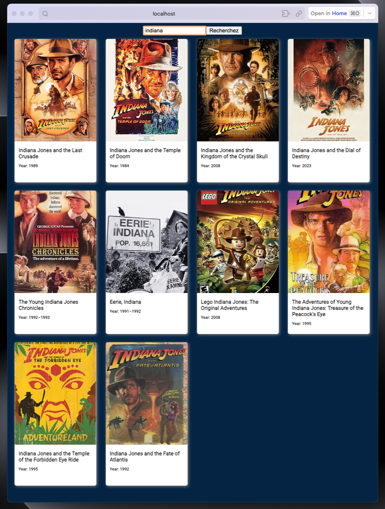

# Vue.js Movie Search Project

This mini project was created to demonstrate the use of Vue.js and Axios for making API calls. The application allows users to search for movies by title, and the results are fetched from the OMDB API.

  

## Features

- **Vue.js Components:** Utilizes Vue.js components for a modular and maintainable project structure.

- **Axios for API Requests:** Axios is used to make asynchronous HTTP requests to the OMDB API, fetching movie data based on user input.

- **Live Search:** Movie results are updated in real-time as the user types in the search bar.

## Technologies Used

- Vue.js
- Axios

